<h1  align="center">Italian Language Course Website</h1>

This website, Learn Italian, is aimed at students, working professionals, and travelers who are interested in learning the Italian language. The website is designed to provide all the information about the Italian courses and it offers a range of Italian language courses in all levels (A1 to C2). Learn Italian, is the go-to destination for those who want to learn Italian and immerse themselves in the Italian culture, no matter what their goals or interests may be.

[View the live project here](https://fazel-hosseinzadeh.github.io/learning-italian/index.html)

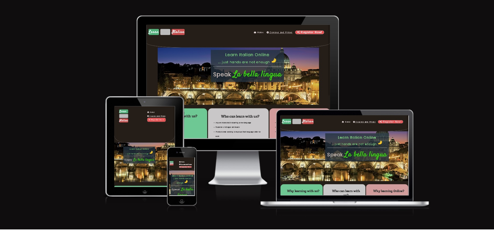

## User experience (UX)

- ### Users:

	- #### First Time Visitor 

	    1. I want to be able to comprehend the primary purpose of the website and learn about the organization easily.

        2. I want to be able to navigate through the website quickly to locate the content I am looking for.

        3. I want to be able to read testimonials from previous customers to establish their credibility and trustworthiness.

	-  #### Returning Visitor 

		1. I want to be able to access the company's services quickly and effortlessly as a returning visitor.

		2. I want to be able to contact the business to request services or seek information as a returning visitor.

	-  #### Frequent User Goals

		1. I want to be able to view the company's newly added work samples regularly as a frequent user.

        2. I want to be able to check out the company's new services as a frequent user.

        3. I want to be able to contact the business to request services, ask questions, follow up on previous conversations, or leave feedback as a frequent user.

- ### Design

	- ### Colour Scheme

		The website incorporates a color scheme that utilizes a dark background to provide a soothing effect for the eyes, while also incorporating the colors of the Italian flag, namely green and red.

	- ### Font

		The primary font used throughout the website is Popinns, with Sans Serif as the fallback font in the event that the font cannot be imported into the website correctly. The Satisfy font is used in the company logo, emphasizing the business' branding. The font is both clean and legible, which is ideal for easy reading. Furthermore, it is a visually appealing font, which reflects the business's aesthetic.

	-	### Imagery

		The background image used in this project is a high-quality, professionally captured photograph of the Vatican and the Tiber River. It serves as the focal point of the website and creates a captivating visual experience for visitors. The image was carefully selected to ensure that it complements the theme and purpose of the website.

## Features

- **Navigation Bar**

	- The navigation bar on the website contains the following items:

        -    **Home**
        -    **Courses and Prices**
        -    **Registration**

        The "Registration" item is a red button with light-colored text to make it more eye-catching. The logo on the navigation bar is the Italian flag, which also contains the name of the website. On smaller devices, the navigation bar will turn to a vertical orientation for better usability.Each navigation link in the menu bar is accompanied by a corresponding icon that is related to its content.
### Laptop view of Navigationbar    
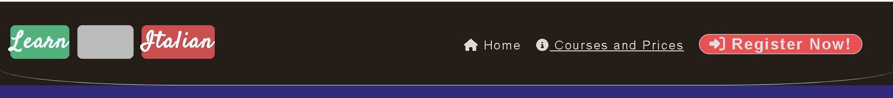

### Mobile view of Navigation Bar 
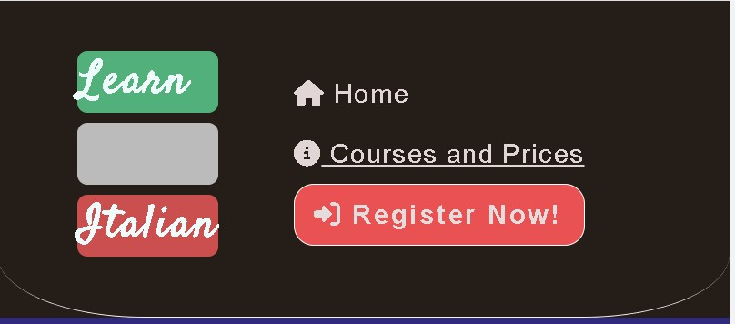

- **Hero Image**
	-   The home page features a stunning image of the Vatican and Tiber River that immediately captures the essence of Italy. A bold, attention-grabbing text overlay reading "Learn Italian - Hands Are Not Enough" reinforces the website's purpose. A unique visual element is the pinched fingers gesture, which signifies Italian gesturing and is incorporated into the design. Another word, "Speak La Bella Lingua", further emphasizes the goal of the website. The image is responsive, ensuring that it looks great on any device, with the design adjusting to the appropriate screen size.
### Laptop view of hero image

### hero image in narrow screen 

-   **Ethos Section**
	-       The Ethos section of the website is designed to showcase the values and philosophy behind the business. It outlines who can benefit from taking the courses and why they should choose to do so with us. The section also explains the advantages of taking the courses online, highlighting the flexibility and convenience it offers to learners.

        -       By taking these courses online, learners can benefit from the convenience of learning from anywhere, at any time. This means they can fit their learning around their busy lives, without compromising on the quality of their education. Our online courses are taught by experienced and qualified teachers who are passionate about helping learners to succeed.
    ### Ethos Sectionn as viewed on laptop    
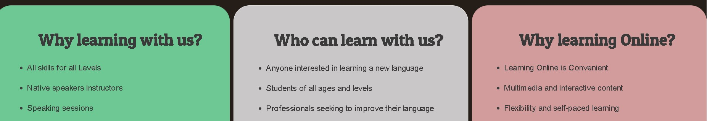

 ### Ethos Sectionn as viewed on Tablet or Mobile    
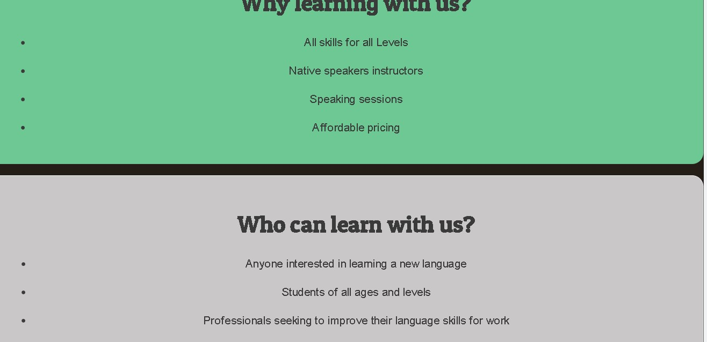

- **Courses and Prices**
	-       The "Courses and Prices" section offers a comprehensive range of Italian language courses for all levels from A1 to C2. Each level has its own dedicated box, providing essential information on the level's content and the target audience. The boxes are designed with a responsive layout, allowing them to adapt to different screen sizes without compromising their readability. Additionally, the background color and text color of each box are carefully chosen to ensure a comfortable and pleasing user experience. The courses come in two options - private and group classes, and both options come with their respective prices clearly displayed, providing potential students with a transparent view of the costs associated with their chosen courses.
###     Courses and Prices as viewed on laptop(3 Column)
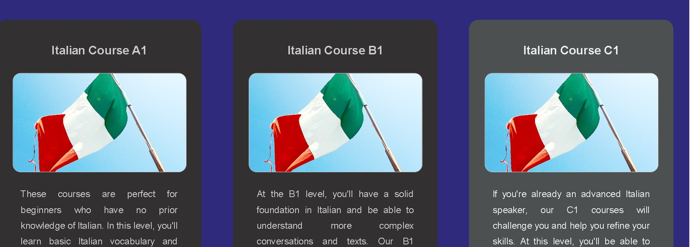

###     Courses and Prices as viewed on Tablet(2 Column)
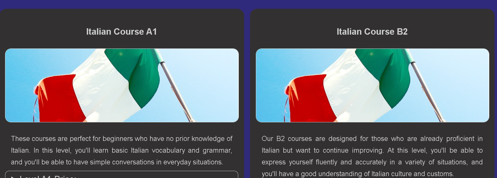

###     Courses and Prices as viewed on Mobile(1 Column)
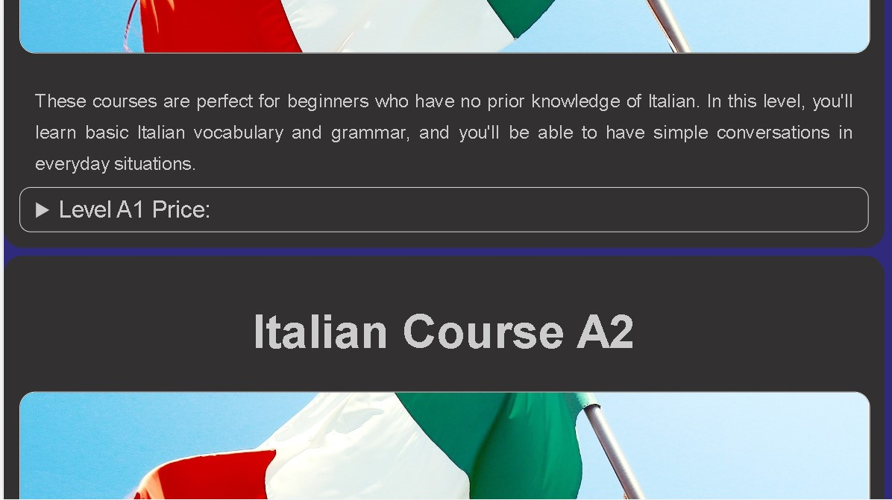

- **Registration Section**
	- The registration feature on the website is designed to allow interested individuals to submit their information and request to join a group or private course. The feature is responsive and can be accessed on any device. The form is designed to collect valid and accurate data from the user, allowing the website to manage and organize courses for groups of people. This feature helps to streamline the registration process and make it more efficient for both the website and the user.

###     Registration Section on laptop
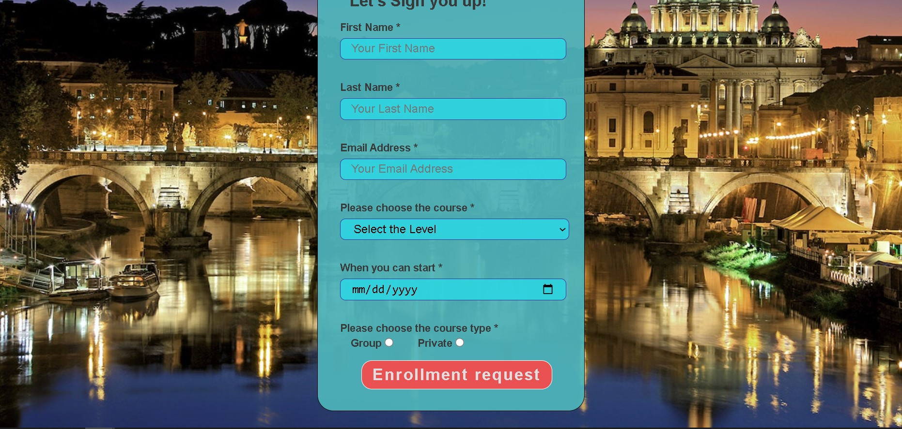

###     Registration Section on Mobile
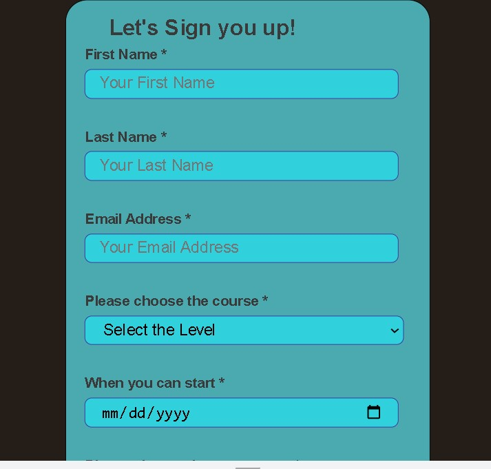

- **Footer**
	- The footer, located at the bottom of the website, contains important contact information for the business, such as their email address, telephone number, and physical address. Additionally, there are links to the business' social media profiles, which are displayed through icons. Users can easily click on these icons to access the business' social media pages.
###     Footer view in Laptop
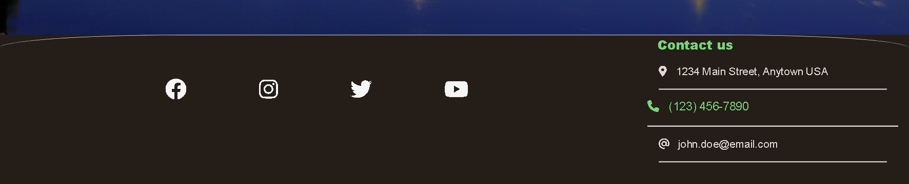

###     Footer view in Mobile
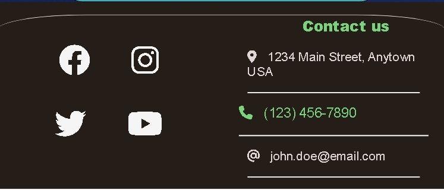

    

